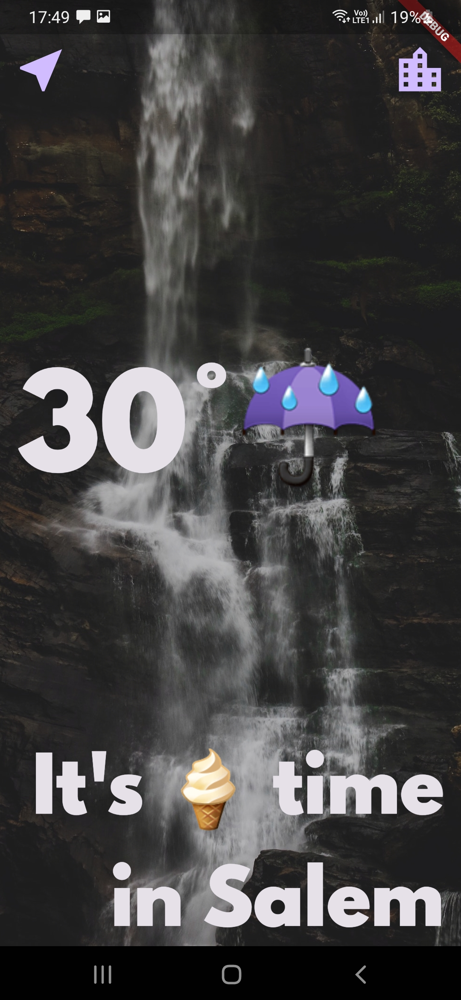
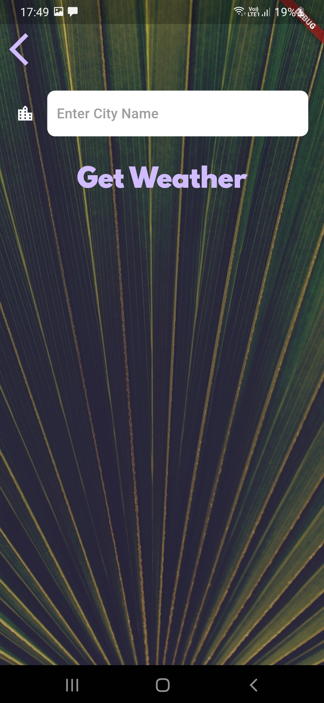

## Clima

A Weather Checking app using API.




> Steps to run

-   Put your OpenWeatherMap API key inside lib/services/weather.dart

```bash
flutter pub get
```

```bash
flutter run
```

<br />

> Things Learned

-   How to get user permission for services like location
-   How to make HTTP request to API
